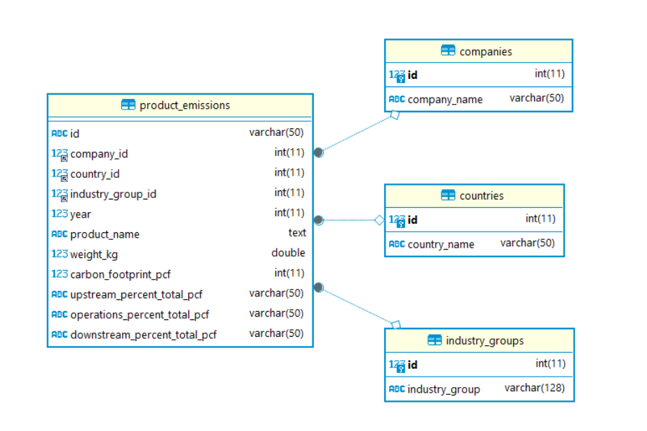

# Carbon Emission Analysis

## 1. Introduction
This report aims to analyze carbon emissions to examine the carbon footprint across various industries. We aim to identify sectors with the highest levels of emissions by analyzing them across countries and years, as well as to uncover trends.

Carbon emissions play a crucial role in the environment, accounting for over 75% of global emissions and posing a significant environmental challenge. These emissions contribute to the accumulation of greenhouse gases in the atmosphere, leading to climate change, planetary warming, and involvement in various environmental disasters.

Through this analysis, we hope to gain an understanding of the environmental impact of different industries and contribute to making informed decisions in sustainable development.

## 2. Data sources

Our dataset is compiled from publicly available data from nature.com and encompasses the product carbon footprints (PCF) for various companies. PCFs represent the greenhouse gas emissions associated with specific products, quantified in CO2 (carbon dioxide equivalent).
## 3. Data Structure

The dataset consists of 4 tables containing information regarding carbon emissions generated during the production of goods.
 

 ## 4. Tables' columns description
### Table 'product_emissions'
- id: Identifier for each product emission record.
- company_id: Identifier for the company associated with the product.
- country_id: Identifier for the country where the product is being produced.
- industry_group_id: Identifier for the industry group to which the product belongs.
- year: The year in which the emissions data was recorded.
- product_name: The name of the product associated with the emissions data.
- weight_kg: The weight of the product in kilograms.
- carbon_footprint_pcf: The carbon footprint of the product, measured in CO2 equivalent.
- upstream_percent_total_pcf: The percentage of the total carbon footprint attributed to upstream activities.
- operations_percent_total_pcf: The percentage of the total carbon footprint attributed to operations.
- downstream_percent_total_pcf: The percentage of the total carbon footprint attributed to downstream activities.
 
### Table 'industry_groups'
- id: Unique identifier for each industry group.
- industry_group: The name of the industry group, categorizing businesses within similar sectors based on their products or services offered.
 
### Table 'companies'
- id: Unique identifier for each company.
- company_name: The name of the company, identifying the specific organization within the dataset.

### Table 'countries'
- id: Unique identifier for each country.
- country_name: The name of the country.

## 5. Tools to use: Using  SQL to query the information needed for analysis purposes throughout this project.

## 6. Carbon Emission Analysis

### Which products contribute the most to carbon emissions?

Get top 10 products contribute the most to carbon emissions

**SQL:**

`SELECT product_name,sum(carbon_footprint_pcf) AS CO2_emissions FROM product_emissions GROUP BY 1 ORDER BY 2 desc LIMIT 10;`

**RESULT:**

| product\_name | CO2\_emissions |
| -----------: | ------------: |
| Wind Turbine G128 5 Megawats | 3718044 |
| Wind Turbine G132 5 Megawats | 3276187 |
| Wind Turbine G114 2 Megawats | 1532608 |
| Wind Turbine G90 2 Megawats | 1251625 |
| TCDE | 198150 |
| Land Cruiser Prado. FJ Cruiser. Dyna trucks. Toyoace.IMV def unit. | 191687 |
| Retaining wall structure with a main wall (sheet pile): 136 tonnes of steel sheet piles and 4 tonnes of tierods per 100 meter wall | 167000 |
| Electric Motor | 160655 |
| Audi A6 | 111282 |
| Average of all GM vehicles produced and used in the 10 year life-cycle. | 100621 |

**INSIGHT:**
Wind Turbine dominate the list of industries that contribute the most to CO2 emissions.

###  What are the industry groups of these products?

Get top 10 industry groups contribute the most to carbon emissions

**SQL:**

`SELECT industry_group,sum(t1.carbon_footprint_pcf) AS CO2_emissions FROM product_emissions AS t1 JOIN industry_groups AS t3 ON t1.industry_group_id = t3.id GROUP BY 1 ORDER BY 2 desc LIMIT 10;`

**RESULT:**

| industry\_group | CO2\_emissions |
| -------------: | ------------: |
| Electrical Equipment and Machinery | 9801558 |
| Automobiles & Components | 2582264 |
| Materials | 577595 |
| Technology Hardware & Equipment | 363776 |
| Capital Goods | 258712 |
| "Food, Beverage & Tobacco" | 111131 |
| "Pharmaceuticals, Biotechnology & Life Sciences" | 72486 |
| Chemicals | 62369 |
| Software & Services | 46544 |
| Media | 23017 |

**INSIGHT:**
Electrical Equipment and Machinery dominate the list of industry groups that contribute the most to CO2 emissions.

### What are the industries with the highest contribution to carbon emissions?

Get the industry group with the highest contribution to carbon emissions

**SQL:**

`SELECT industry_group,sum(t1.carbon_footprint_pcf) AS CO2_emissions FROM product_emissions AS t1 JOIN industry_groups AS t3 ON t1.industry_group_id = t3.id GROUP BY 1 ORDER BY 2 desc LIMIT 1;`

**RESULT:**

| industry\_group | CO2\_emissions |
| -------------: | ------------: |
| Electrical Equipment and Machinery | 9801558 |

**INSIGHT:**
Electrical Equipment and Machinery is the industry with the highest contribution to carbon emissions.

###  What are the companies with the highest contribution to carbon emissions?

Get the companies with the highest contribution to carbon emissions

**SQL:**

`SELECT company_name,sum(t1.carbon_footprint_pcf) AS CO2_emissions FROM product_emissions AS t1 JOIN companies AS t2 ON t1.company_id = t2.id GROUP BY 1 ORDER BY 2 desc LIMIT 1;`

**RESULT:**

| company\_name | CO2\_emissions |
| -----------: | ------------: |
| "Gamesa Corporación Tecnológica, S.A." | 9778464 |

**INSIGHT:**
Gamesa Corporación Tecnológica, S.A. is the company with the highest contribution to carbon emissions.

### What are the countries with the highest contribution to carbon emissions?

**SQL:**

`SELECT country_name,sum(t1.carbon_footprint_pcf) AS CO2_emissions FROM product_emissions AS t1 JOIN countries AS t3 ON t1.country_id = t3.id GROUP BY 1 ORDER BY 2 desc LIMIT 1;`

**RESULT:**

| country\_name | CO2\_emissions |
| -----------: | ------------: |
| Spain | 9786130 |

**INSIGHT:**
Spain is the country with the highest contribution to carbon emissions.

### What is the trend of carbon footprints (PCFs) over the years?

**SQL:**

`SELECT year, sum(carbon_footprint_pcf) as sum_carbon
FROM (
  		SELECT DISTINCT *
  		FROM product_emissions
  ) AS clean_data
GROUP BY year
ORDER BY year
`

**RESULT:**

| year | sum_carbon | 
| ---: | ---------: | 
| 2013 | 496076     | 
| 2014 | 548229     | 
| 2015 | 10810407   | 
| 2016 | 1612760    | 
| 2017 | 228531     | 

**INSIGHT:**
Carbon footprint has been on an increasing trend from 2013 to 2015. There was a significant increase in 2015. And it started to decrease again in 2016 and 2017.

