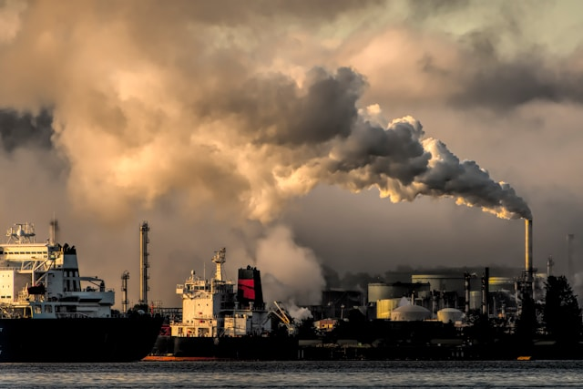

# Carbon Emission Analysis

## 1. Introduction
This report aims to analyze carbon emissions to examine the carbon footprint across various industries. We aim to identify sectors with the highest levels of emissions by analyzing them across countries and years, as well as to uncover trends.

Carbon emissions play a crucial role in the environment, accounting for over 75% of global emissions and posing a significant environmental challenge. These emissions contribute to the accumulation of greenhouse gases in the atmosphere, leading to climate change, planetary warming, and involvement in various environmental disasters.

Through this analysis, we hope to gain an understanding of the environmental impact of different industries and contribute to making informed decisions in sustainable development.

## 2. Data sources

Our dataset is compiled from publicly available data from nature.com and encompasses the product carbon footprints (PCF) for various companies. PCFs represent the greenhouse gas emissions associated with specific products, quantified in CO2 (carbon dioxide equivalent).
## 3. Data Structure

The dataset consists of 4 tables containing information regarding carbon emissions generated during the production of goods.
 
